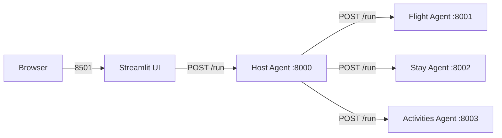

# Docker

## Prerequisites

Create a `.env` file in the project root with your API key:

```
DEEPSEEK_API_KEY=your-deepseek-api-key
```

## Run

```sh
docker compose up --build
```

- Streamlit UI: http://localhost:8501
- Host agent API: http://localhost:8000/run

## Services

| Service       | Port | Command                                  |
|---------------|------|------------------------------------------|
| host          | 8000 | `uvicorn agents.host_agent.__main__:app` |
| flight        | 8001 | `uvicorn agents.flight_agent.__main__:app` |
| stay          | 8002 | `uvicorn agents.stay_agent.__main__:app` |
| activities    | 8003 | `uvicorn agents.activities_agent.__main__:app` |
| streamlit-ui  | 8501 | `streamlit run travel_ui.py`             |

## Architecture



## Env vars

Override agent URLs via environment (defaults work with docker-compose):

```
FLIGHT_URL=http://flight:8001/run
STAY_URL=http://stay:8002/run
ACTIVITIES_URL=http://activities:8003/run
HOST_URL=http://host:8000/run
```
